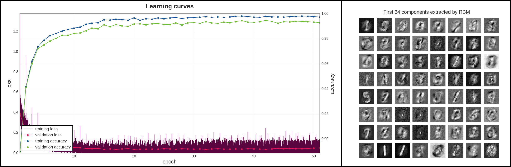

# ML MNIST Challenge
This contest was offered within TU Munich's course Machine Learning (IN2064).<br>
The goal was to implement k-NN, Neural Network, Logistic Regression and Gaussian Process Classifier in 
python from scratch and achieve minimal average test error among these classifiers on well-known MNIST dataset, 
without ensemble learning.

## Results
| Algorithm | <div align="center">Description</div> | Test Error, % |
| :---: | :--- | :---: |
| ***k-NN*** | 3-NN, Euclidean distance, uniform weights.<br/>*Preprocessing*: Feature vectors extracted from ***NN***. | **1.13** |
| ***k-NN<sub>2</sub>*** | 3-NN, Euclidean distance, uniform weights.<br/>*Preprocessing*: Augment (training) data (&#215;9) by using random rotations,<br/>shifts, Gaussian blur and dropout pixels; PCA-35 whitening and multiplying<br/>each feature vector by e<sup>11.6 &#183; ***s***</sup>, where ***s*** &ndash; normalized explained<br/>variance by the respective principal axis. (equivalent to applying PCA<br/>whitening with accordingly weighted Euclidean distance). | **2.06** |
| ***NN*** | MLP 784-1337-D(0.05)-911-D(0.1)-666-333-128-10 (D &ndash; dropout);<br/>hidden activations &ndash; LeakyReLU(0.01), output &ndash; softmax; loss &ndash; categorical<br/>cross-entropy; 1024 batches; 42 epochs; optimizer &ndash; *Adam* (learning rate<br/>5 &#183; 10<sup>&ndash;5</sup>, rest &ndash; defaults from paper).<br/>*Preprocessing*: Augment (training) data (&#215;5) by using random rotations,<br/> shifts, Gaussian blur. | **1.04** |
| ***LogReg*** | 32 batches; 91 epoch; L2-penalty, &#955; = 3.16 &#183; 10<sup>&ndash;4</sup>; optimizer &ndash; *Adam* (learning<br/>rate 10<sup>&ndash;3</sup>, rest &ndash; defaults from paper)<br/>*Preprocessing*: Feature vectors extracted from ***NN***. | **1.01** |
| ***GPC*** | 794 random data points were used for training; &#963;<sub>n</sub> = 0; RBF kernel (&#963;<sub>f</sub> = 0.4217,<br/>&#947; = 1/2l<sup>2</sup> = 0.0008511); Newton iterations for Laplace approximation till<br/>&#916;Log-Marginal-Likelihood &leq; 10<sup>&ndash;7</sup>; solve linear systems iteratively using CG with<br/> 10<sup>&ndash;7</sup> tolerance; for prediction generate 2000 samples for each test point.<br/>*Preprocessing*: Feature vectors extracted from ***NN***. | **1.59** |

## Visualizations

And more available in `experiments/plots/`.

## How to install
```bash
git clone https://github.com/monsta-hd/ml-mnist
cd ml-mnist/
pip install -r requirements.txt
```
After installation, tests can be run with:
```bash
make test
```

## How to run
Check [main.py](main.py) to reproduce training and testing the final models:
```bash
usage: main.py [-h] [--load-nn] model

positional arguments:
  model       which model to run, {'gp', 'knn', 'knn-without-nn', 'logreg',
              'nn'}

optional arguments:
  -h, --help  show this help message and exit
  --load-nn   whether to use pretrained neural network, ignored if 'knn-
              without-nn' is used (default: False)
```

## Experiments
Check also [this notebook](https://nbviewer.jupyter.org/github/monsta-hd/ml-mnist/blob/master/experiments/cross_validations.ipynb) to see what I've tried.<br/>
**Note**: the approach RBM + LogReg gave only at most `91.8%` test accuracy since RBM takes too long to train with given pure python code, thus it was only trained on small subset of data (and still underfitted). However, with properly trained RBM on the whole training set, this approach can give `1.83%` test error (see my [Boltzmann machines project](https://github.com/monsta-hd/boltzmann-machines))

## Features
* Apart from specified algorithms, there are also PCA and RBM implementations
* Most of the classes contain doctests so they are easy to understand
* All randomness in algorithms or functions is reproducible (seeds)
* Support of simple readable serialization (JSON)
* There are also some infrastructure for model selection, feature selection, data augmentation, metrics, plots etc.)
* Support for ***MNIST*** or ***Fashion MNIST*** (both have the same structure thus both can be loaded using the [same routine](ml_mnist/utils/dataset.py)), haven't tried the latter yet, though

## System
All computations and time measurements were made on laptop `i7-5500U CPU @ 2.40GHz x 4` `12GB RAM`

## Possible future work
Here the list of what can also be tried regarding these particular 4 ML algorithms (didn't have time to check it, or it was forbidden by the rules, e.g. ensemble learning):
* Model averaging for k-NN: train a group of k-NNs with different parameter *k* (say, 2, 4, ..., 128) and average their predictions;
* More sophisticated metrics (say, from `scipy.spatial.distance`) for k-NN;
* Weighting metrics according to some other functions of explained variance from PCA;
* NCA;
* Different kernels or compound kernels for k-NN;
* Commitee of MLPs, CNN, commitee of CNNs or more advanced NNs;
* Unsupervised pretraining for MLP/CNN;
* Different kernels or compound kernels for GPCs;
* 10 one-vs-rest GPCs;
* Use derivatives of Log-Marginal-Likelihood for multiclass Laplace approximation w.r.t kernel parameters for more efficient gradient-based optimization;
* Model averaging for GPCs: train a collection of GPCs on different parts of the data and then average their predictions (or bagging);
* IVM.
